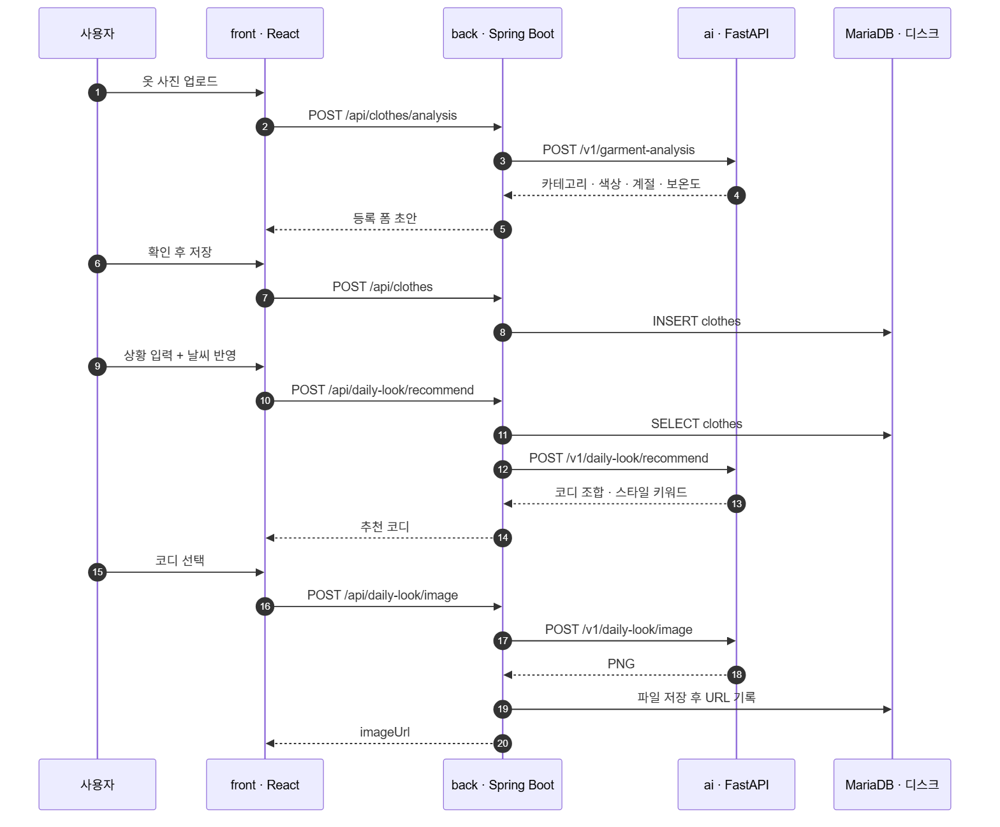
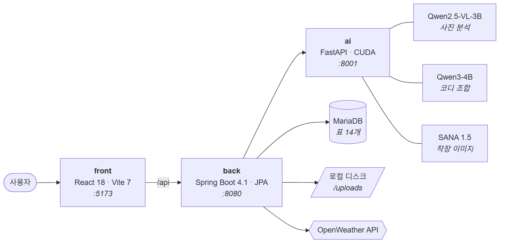

<div align="center">

# MyCloset

**옷장을 찍어 두면, 날씨와 상황에 맞는 코디를 추천하고 착장 이미지까지 만들어 주는 AI 옷장 서비스**

[](https://github.com/it-works-for-now/MyCloset_Open_Source/actions/workflows/ci.yml)
[](LICENSE)
[](back)
[](back)
[](front)
[](ai)

</div>

---

## 서비스 이용 방법

1. **회원 가입하고 로그인합니다.**

   -> 옷장은 계정마다 따로 관리되므로, 로그인해야 본인 옷장이 열립니다.

2. **옷 사진을 올려 옷장을 채웁니다.**

   -> 비전 언어 모델이 카테고리, 색상, 패턴, 계절, 보온도를 자동으로 읽어 기록합니다. 모델이 확신하지 못한 항목만 직접 확인하면 됩니다.

3. **상황을 입력해 코디를 추천받습니다.**

   -> 언어 모델이 **가지고 있는 옷만으로** 조합을 고릅니다. 날씨 반영을 켜 두면 현재 위치의 날씨까지 함께 넘어갑니다.

4. **추천받은 코디의 착장 이미지를 확인합니다.**

   -> 이미지 생성 모델이 그 조합을 입은 모습을 그려 줍니다.

5. **마음에 드는 코디를 저장합니다.**

   -> 저장한 코디는 옷장에서 다시 꺼내 볼 수 있습니다.

6. **핏로그와 게시판에 공유합니다.**

   -> 핏로그로 방을 만들고 코드로 친구를 초대해 코디를 공유하거나, 게시판에 올려 전체 사용자와 공유할 수 있습니다.

2026년 가천대학교 컴퓨터공학과·인공지능학과 연합 학술제 출품작의 최종본입니다.

## 주요 기능

| 기능 | 설명 |
| --- | --- |
| 옷⁠장 | 사진 한 장을 올리면 속성이 자동으로 채워집니다. 모델이 확신하지 못한 항목은 사용자에게 확인을 요청합니다. |
| 코⁠디⁠ ⁠추⁠천 | 상황을 문장으로 입력하면 언어 모델이 옷장에 등록된 옷 중에서만 조합을 고릅니다. |
| 착⁠장⁠ ⁠이⁠미⁠지 | 선택된 조합을 사람이 입은 모습으로 그립니다. |
| 날⁠씨⁠ ⁠반⁠영 | 요청할 때 켜 두면 현재 위치의 날씨를 추천의 입력으로 함께 넘깁니다. |
| 저⁠장⁠한⁠ ⁠코⁠디 | 마음에 드는 조합을 옷장에 남겨 두고 다시 꺼내 볼 수 있습니다. |
| 핏⁠로⁠그 | 방 코드로 사람을 초대해 착장 기록을 공유하고 서로 반응을 남깁니다. |
| 게⁠시⁠판 | 코디와 후기를 글로 올리고 함께 봅니다. |
| 계⁠정 | JWT 기반 회원 가입과 로그인을 지원합니다. |

## 전체 흐름

옷을 등록하고 코디를 받아 보기까지, 요청이 프론트엔드에서 백엔드를 거쳐 AI 서버로 오가는 경로입니다.

<picture>
  <source media="(prefers-color-scheme: dark)" srcset="docs/flow-dark.png">
  
</picture>

## 아키텍처

세 컴포넌트와 외부 서비스가 어떤 방향으로 연결되는지 정리한 그림입니다.

<picture>
  <source media="(prefers-color-scheme: dark)" srcset="docs/architecture-dark.png">
  
</picture>

설계에서 지킨 규칙이 세 개 있습니다.

1. **외부 호출은 백엔드만 한다.**

   -> 프론트는 백엔드 하나만 호출하고, AI 서버와 외부 API 는 백엔드가 중계합니다.

2. **GPU 작업은 한 번에 하나만 돈다.**

   -> 세 모델이 한 장의 GPU 를 공유하므로 `GPUInferenceManager` 가 추론을 직렬화합니다.

3. **이미지 파일은 DB 에 넣지 않는다.**

   -> 파일은 디스크에 저장하고 DB 에는 공개 URL 만 기록합니다.

## 저장소 구조

```
MyCloset_Open_Source
├── front/                     React 18 · Vite 7
│   ├── index.html             진입 문서
│   ├── img/                   화면에 쓰는 이미지 에셋
│   └── src/
│       ├── main.jsx           React 진입점
│       ├── pages/             화면 단위 컴포넌트
│       ├── components/        공용 UI
│       ├── data/              화면에서 쓰는 상수
│       └── utils/             API 호출과 검증 로직
│
├── back/                      Spring Boot 4.1 · Java 21
│   └── src/main/java/com/mycloset/backend/
│       ├── auth/              JWT 인증과 회원
│       ├── clothes/           옷장과 AI 서버 중계
│       ├── dailylook/         코디 추천과 착장 이미지
│       ├── styling/           저장된 코디
│       ├── fitlog/            핏로그 방과 반응
│       ├── post/              게시판
│       └── security/          Spring Security 설정
│
├── ai/                        FastAPI · 모델 세 개를 한 프로세스에서 운용
│   └── app/
│       ├── analysis_model.py  Qwen2.5-VL  의류 속성 추출
│       ├── recommend_model.py Qwen3-4B    코디 조합 선택
│       ├── image_model.py     SANA 1.5    착장 이미지 생성
│       ├── gpu_manager.py     GPU 추론 직렬화
│       └── main.py            엔드포인트 정의
│
├── scripts/                   준비와 실행 스크립트 (setup.ps1 · dev.ps1 · dev.sh)
└── docs/                      다이어그램 원본과 렌더링된 이미지
```

## 요구 사항

| 컴포넌트 | 필요한 것 |
| --- | --- |
| `back` | JDK 21, MariaDB 또는 MySQL |
| `front` | Node 20 이상 (npm 포함) |
| `ai` | Python 3.12 이상, CUDA 를 지원하는 NVIDIA GPU |

CI 도 같은 조합에서 돌기 때문에, 이 버전을 맞추면 로컬에서 통과한 빌드가 CI 에서 어긋나는 일이 줄어듭니다.

GPU 는 `ai` 에만 필요합니다. 없으면 `ai` 를 빼고 나머지 둘만 띄워도 AI 기능을 제외한 화면은 전부 동작합니다.
개발에 쓴 기준은 VRAM 12 GB 이고, 세 모델이 GPU 한 장을 나눠 쓰므로 여유가 없다면 `ai/.env` 의 `IMAGE_OFFLOAD=true` 로 이미지 모델을 호출 시점에만 GPU 에 올릴 수 있습니다.

## 실행 방법

두 가지 방법으로 실행할 수 있습니다. 스크립트가 창을 대신 열어 주는 쪽과, 세 서버를 직접 하나씩 띄우는 쪽입니다.
처음 받아 본다면 스크립트 쪽이 빠르고, 각 서버가 무엇을 읽고 어디에 붙는지 확인하려면 직접 실행 쪽이 낫습니다.
어느 쪽이든 결국 백엔드 · 프론트엔드 · AI 서버 세 개가 동시에 떠 있어야 합니다.

> [!IMPORTANT]
> `JWT_SECRET` 은 기본값이 없습니다.
> `back/src/main/resources/application-local.yml` 에 값을 채우지 않으면 백엔드가 기동 도중 실패합니다.

> [!IMPORTANT]
> `requirements.txt` 에는 PyTorch 가 들어 있지 않습니다.
> CUDA 빌드를 따로 설치하지 않으면 AI 서버가 모델을 올리는 지점에서 실패합니다.

<details>
<summary>스크립트로 실행</summary>

Windows PowerShell 기준입니다. 저장소를 받고 준비 스크립트를 한 번 실행해야 합니다.

```powershell
git clone https://github.com/it-works-for-now/MyCloset_Open_Source.git
cd MyCloset_Open_Source
.\scripts\setup.ps1     # 설정 파일 생성 + 의존성 설치
```

`setup.ps1` 은 세 가지를 합니다.
`application-local.yml` 과 `front/.env`, `ai/.env` 를 각각의 `.example` 에서 복사하고, 프론트의 `npm install` 을 돌리고, `ai/.venv` 가상환경을 만들어 `requirements.txt` 를 설치합니다.
이미 있는 설정 파일은 덮어쓰지 않으므로 여러 번 실행해도 안전합니다.

다만 `setup.ps1` 은 PyTorch 를 설치하지 않습니다. AI 서버까지 쓸 계획이라면 CUDA 빌드를 한 번 더 얹어야 합니다.

```powershell
ai\.venv\Scripts\python.exe -m pip install --index-url https://download.pytorch.org/whl/cu128 torch torchvision
```

복사만 된 상태라 값은 아직 자리표시자입니다.
`back/src/main/resources/application-local.yml` 을 열어 DB 접속 정보와 `JWT_SECRET` 을 채워야 합니다.

```powershell
.\scripts\dev.ps1        # 세 서버를 각각 새 창에서 실행
```

`dev.ps1` 은 PowerShell 창 세 개를 새로 열어 백엔드, 프론트엔드, AI 서버를 하나씩 띄웁니다.
창 제목에 서버 이름과 포트가 적히므로 로그를 따로 볼 수 있고, 서버를 내릴 때는 해당 창을 닫으면 됩니다.

Linux · macOS 는 `./scripts/dev.sh` 를 쓰면 됩니다.
이쪽은 창을 나누지 않고 한 셸에서 세 서버를 백그라운드로 띄운 뒤 `Ctrl+C` 로 한꺼번에 내릴 수 있습니다.
다만 `setup.ps1` 에 대응하는 셸 스크립트는 없습니다. 준비 단계는 아래를 한 번 실행해 대신합니다.

```bash
cp back/src/main/resources/application-local.yml.example back/src/main/resources/application-local.yml
cp front/.env.example front/.env
cp ai/.env.example ai/.env
(cd front && npm install)
python -m venv ai/.venv
ai/.venv/bin/pip install --index-url https://download.pytorch.org/whl/cu128 torch torchvision
ai/.venv/bin/pip install -r ai/requirements.txt
```

프론트엔드 창에 Vite 가 뜨면서 접속 주소를 출력합니다. 거기 뜬 URL 로 들어가면 됩니다. (예: `http://localhost:5173/`)
개발 서버가 `--host 0.0.0.0` 으로 떠서 `Local` 과 `Network` 두 줄이 나오는데, 같은 공유기에 붙은 휴대폰에서 열어 볼 때는 `Network` 주소를 쓰면 됩니다.

GPU 가 없다면 AI 서버를 빼고 띄웁니다.

```powershell
.\scripts\dev.ps1 -SkipAi      # Linux · macOS: SKIP_AI=1 ./scripts/dev.sh
```

</details>

<details>
<summary>직접 실행</summary>

백엔드, 프론트엔드, AI 서버를 각각 다른 터미널에서 띄워야 합니다.
아래 세 묶음은 모두 저장소 루트에서 시작하는 것을 전제로 합니다.
한 창에서 이어 붙여 실행하면 `cd` 가 쌓여 `back/front` 같은 경로를 찾게 되므로, 창을 세 개 열어 하나씩 맡기는 편이 확실합니다.

터미널 하나는 백엔드를 맡습니다.

```bash
# 저장소 루트에서 시작합니다.
cd back
cp src/main/resources/application-local.yml.example src/main/resources/application-local.yml
```

복사한 `application-local.yml` 을 열어 DB 접속 정보와 `JWT_SECRET` 을 채워야 합니다.
값을 채운 뒤에 실행합니다.

```bash
./gradlew bootRun
```

두 번째 터미널은 프론트엔드를 맡습니다.

```bash
# 저장소 루트에서 시작합니다.
cd front
cp .env.example .env
npm install
npm run dev
```

`.env` 의 `VITE_API_BASE_URL` 은 기본값이 `http://localhost:8080/api` 라서, 백엔드를 같은 PC 에서 띄웠다면 손댈 필요가 없습니다.
백엔드를 다른 기기에서 돌린다면 이 값을 그 주소로 바꿔야 합니다.

세 번째 터미널은 AI 서버를 맡습니다.

```bash
# 저장소 루트에서 시작합니다.
cd ai
cp .env.example .env
python -m venv .venv
source .venv/bin/activate     # Windows PowerShell: .venv\Scripts\Activate.ps1
pip install --index-url https://download.pytorch.org/whl/cu128 torch torchvision
pip install -r requirements.txt
python -m app.main
```

CUDA 빌드는 배포 채널이 따로 있어서 위와 같이 먼저 설치합니다.
`cu128` 은 이 저장소가 기준으로 삼은 CUDA 12.8 빌드이며, 드라이버가 더 낮다면 그에 맞는 채널로 바꿔야 합니다.

세 서버가 모두 떴다면 프론트엔드 터미널에 Vite 가 출력한 URL 로 들어가면 됩니다. (예: `http://localhost:5173/`)

AI 서버는 첫 실행에서 모델 가중치를 Hugging Face 에서 내려받습니다.
이미지 모델만 9 GB 가 넘어 시간이 걸리고, 저장 위치는 `ai/.env` 의 `HF_HOME` 으로 옮길 수 있습니다.

GPU 가 없다면 세 번째 터미널을 열지 않습니다.

</details>

## 포트

| 컴포넌트 | 포트 | 비고 |
| --- | --- | --- |
| `front` | 5173 | Vite 개발 서버 |
| `back` | 8080 | 프론트와 AI 서버를 잇는 유일한 지점 |
| `ai` | 8001 | 모델 세 개가 한 프로세스에 상주 |

## 채워야 하는 값

민감 정보는 저장소에 포함하지 않았습니다. 아래 네 개는 직접 채워야 합니다.

| 값 | 위치 | 설명 |
| --- | --- | --- |
| `DB_PASSWORD` | `back/…/application-local.yml` | MariaDB 접속 비밀번호입니다 |
| `JWT_SECRET` | `back/…/application-local.yml` | 기본값이 없어 비워 두면 백엔드가 기동에 실패합니다 |
| `WEATHER_API_KEY` | `back/…/application-local.yml` | [OpenWeatherMap](https://home.openweathermap.org/api_keys) 에서 발급하는 무료 키입니다 |
| `AI_API_KEY` | `ai/.env` | 비워 두면 인증이 꺼집니다. 외부에 노출된 환경에서는 반드시 설정해야 합니다 |

`JWT_SECRET` 에 기본값을 두지 않은 것은 의도적입니다. 개발용 고정 시크릿이 운영으로 새어 나가는 것을 막습니다.

## 자주 발생하는 문제

처음 실행할 때 자주 걸리는 지점을 모았습니다.

| 증상 | 원인과 해결 |
| --- | --- |
| 백⁠엔⁠드⁠가 기⁠동⁠에 실⁠패⁠함 | `JWT_SECRET` 이 비어 있는 경우입니다. 기본값이 없으므로 값을 채워야 뜹니다. |
| 백⁠엔⁠드⁠가 스⁠키⁠마 검⁠증⁠에⁠서 멈⁠춤 | `ddl-auto` 가 `validate` 라서 테이블을 자동으로 만들지 않습니다. DB 스키마를 먼저 맞춰야 합니다. |
| A⁠I 서⁠버⁠가 `torch` 를 찾⁠지 못⁠함 | `requirements.txt` 에 PyTorch 가 없습니다. CUDA 빌드를 별도 채널에서 먼저 설치해야 합니다. |
| A⁠I 서⁠버 첫 실⁠행⁠이 오⁠래 걸⁠림 | 모델 가중치를 내려받는 중입니다. 이미지 모델만 9 GB 가 넘습니다. 저장 위치는 `ai/.env` 의 `HF_HOME` 으로 옮길 수 있습니다. |
| 추⁠론 도⁠중 V⁠R⁠A⁠M 이 부⁠족⁠함 | 다른 GPU 프로세스를 먼저 닫고, 그래도 모자라면 `IMAGE_OFFLOAD=true` 를 켭니다. |
| 화⁠면⁠에⁠서 옷 사⁠진⁠이 깨⁠짐 | 백엔드의 `CLOTHES_IMAGE_PUBLIC_BASE_URL` 이 실제 접속 주소와 다른 경우입니다. |

## AI 서버 API

| 메서드 | 경로 | 하는 일 |
| --- | --- | --- |
| `GET` | `/health` | 세 모델의 적재 상태와 CUDA 장치 |
| `POST` | `/v1/garment-analysis` | 옷 사진 한 장에서 속성 추출 |
| `POST` | `/v1/daily-look/recommend` | 옷장과 상황으로 코디 조합 선택 |
| `POST` | `/v1/daily-look/image` | 선택한 코디의 착장 이미지 생성 |

자세한 요청·응답 형식은 [`ai/README.md`](ai/README.md) 에 있습니다.

## 사용한 모델

| 모델 | 종류 | 크기 |
| --- | --- | --- |
| `Qwen/Qwen2.5-VL-3B-Instruct` | 비전 언어 모델 | 3B |
| `Qwen/Qwen3-4B-Instruct-2507` | 언어 모델 | 4B |
| `Efficient-Large-Model/SANA1.5_1.6B_1024px_diffusers` | 이미지 생성 모델 | 1.6B |

세 모델이 무엇을 하는지는 위 `AI 서버 API` 의 엔드포인트와 일대일로 대응합니다.

가중치는 저장소에 들어 있지 않습니다.
이 저장소의 MIT 라이선스는 우리가 쓴 코드에만 적용되며, 모델 가중치에는 각 배포처의 라이선스가 따로 걸립니다.
그대로 가져다 쓰기 전에 배포처의 조건을 확인하시기 바랍니다.

## 더 읽을 문서

| 문서 | 내용 |
| --- | --- |
| [`back/README.md`](back/README.md) | 백엔드 설정, 이미지 저장 규칙, 배포에서의 Nginx 연결 |
| [`front/README.md`](front/README.md) | 프론트 개발 서버와 환경 변수 |
| [`ai/README.md`](ai/README.md) | AI 서버 API 명세, 이미지 모델 프로파일, GPU 직렬화 |

## 기여

이슈와 PR 은 언제나 환영합니다.
브랜치 규칙과 포맷 도구, PR 을 열기 전에 통과시켜야 하는 검사는 [`CONTRIBUTING.md`](CONTRIBUTING.md) 를 참고해 주세요.

## 팀 소개

가천대학교 컴퓨터공학과·인공지능학과 네 명이 함께 만들었습니다.

| 이름 | 학과 | 담당 |
| --- | --- | --- |
| 전영준 | 컴퓨터공학과 | 팀장, Full Stack. 프론트엔드 화면, 백엔드 API, AI 코디 서버, 배포 |
| 강민서 | 컴퓨터공학과 | Frontend. React 화면 전 구간 |
| 한유진 | 인공지능학과 | Backend, AI. Spring Boot API, DB 설계, FastAPI 분석 서버 |
| 안예은 | 인공지능학과 | AI 리서치·기획. 모델 선정 조사, 프롬프트 형식 연구, 발표자료 제작 |

## 라이선스

[MIT License](LICENSE)

`front/img/` 아래의 이미지 에셋 일부는 화면 구성을 위해 사용한 것으로 MIT 적용 범위에서 제외될 수 있습니다.
재배포 전에 개별 출처를 확인하시기 바랍니다.
